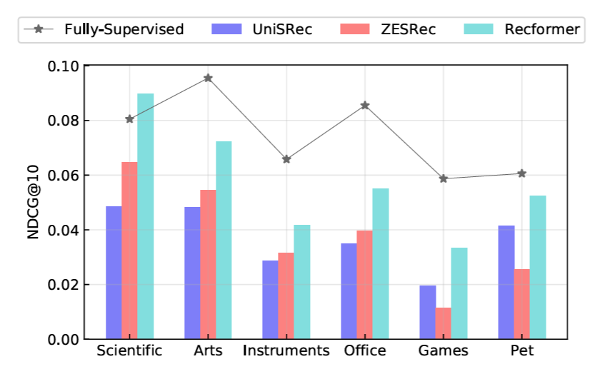

# Original Paper

## Evaluation (Paper: Figure 4 in zero-shot setting)

## Evaluation (Paper: Table 2 with 2-stage finetune)

| Index | Dataset Category              | NDCG@10   | Recall@10 | MRR       |
|-------|-------------------------------|-----------|-----------|-----------|
| 1     | Industrial and Scientific     | 0.10270   | 0.14480   | 0.09510   |
| 2     | Arts Crafts and Sewing        | 0.12520   | 0.16140   | 0.11890   |
| 3     | Video Games                   | 0.06840   | 0.10390   | 0.06500   |
| 4     | Musical Instruments           | 0.08300   | 0.10520   | 0.08070   |
| 5     | Office Products               | 0.11410   | 0.14030   | 0.10890   |

